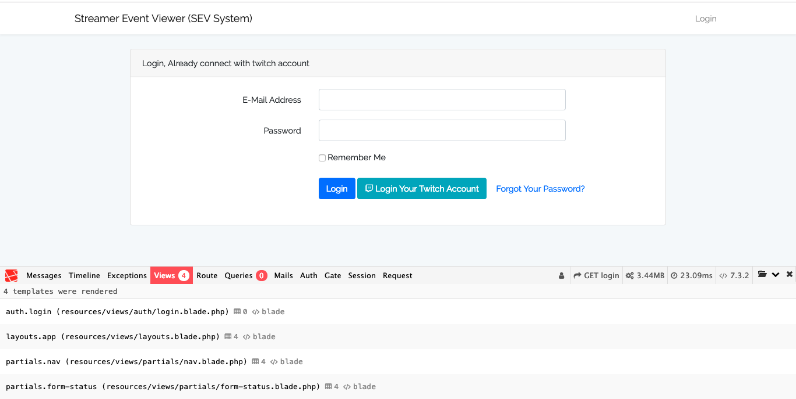

# Streamer Event Viewer (SEV-System)
SEV-System is the subsystem which is developed for the twitch audience to see their favorite streamer's twitch events in real time. In the evaluation of the system that has been trying to deliver the best application within the limitation of time but there was still possible to implement new features and functionality for the best attractive product. Therefore, the project live demo, repository, and screencast video are following below:

**Version**: 1.0 Release of the Twitch Streamer Events Viewer (SEV-System).

- Application Live: https://live-sev.herokuapp.com
- Screencast video for live demo presentation without audio:
<a href="https://www.useloom.com/share/5e7a93bd7aa64fc7b55a33b70b19a0e8"></a>

***


## Table of Contents
* [Overview](#overview)
* [Problem Domain Area](#problem-Domain-Area)
* [The Advantages of System](#The-Advantages-of-System)
* [The Limitations of System](#The-Limitations-of-System)
* [The System Features List](#system-features-list)
* [Entity Relationship Diagram (ERD)](#Entity-Relationship-Diagram)
* [Technologies and Libraries](#technologies-and-libraries)
* [Further Development](#further-development)
* [How to run the System](#how-to-run-the-system)
* [Questions and Answers](#questions-and-answers)
* [Summary](#summary)
* [References](#references)

*** 

## Overview
This is identified that the project developed as calling name SEV-System. The system handles any twitch users for their specific requirements such as set favorite streamer name, their embedded live streaming, recent events and chatting just like a sub-system of the Twitch TV. It's totally depended on the Twitch API, which is used by their twitch account ID, that is must be required for their next pages load. Therefore, the system is completely run error-free in that checking period.

## Problem Domain Area
- Build a backend web application that helps its audience see their favorite streamer's events in real-time.
- Streamer's live-streaming, chat with recent 10 events feature are included.
- The solution provides any twitch user to login with twitch oAuth.
- Also enables the user to chat on their favorite channels. 


## The Advantages of System
- The application is fully responsive.
- Authenticated by the security route such as web, active and current users based.
- validation and verification with relevant error and success message.
- Highly strong Laravel framework, ORM with database design.
- Custom error messaging with custom error pages.


## The Limitations of System
- The system is not used highly graphics and best UX design.
- Any information can't modify within the single click.
- Users can't find their following twitch name in real time just like Twitch.
- The system didn't config any mailing system for notifications.


## The System Features List
- login with twitch account
- User Following Channel list
- Set Favorite Steamer Name
- Streamer live streaming page with chat
- Streamer recent 10 events 
- User profile information change
- After password set using the default login form
- The user can delete their own account.


## Entity-Relationship-Diagram


## Technologies and libraries
- Laravel 5+, PHP 7+.
- Laravel socialite for Twitch login.
- HTTP Client for JSON API.
- Bootstrap, SCSS, and default level layouts.
- MySQL for local, PgSQL for Heroku.
- jQuery, Ajax for validation and verification.


## Further Development 
- A user can follow new streamer's through the system.
- Highly UX design with graphical and visual chart reports.
- Personal email processing within the mail notification system.
- Refresh the authentication token when it will be expired.
- Refactoring coding standard with live data loaded.
- Testing plan implements with PHPUnit tools.

## How to run the System

### Run on the development environment
* Open terminal window with your dev area
* Then run this below comments
```sh
$ git clone https://github.com/vorsurm/sev-system.git

$ cd sev-system
$ composer install
$ cp .env.example .env
$ php artisan key:generate
$ config .env file, below description
$ php artisan migrate
$ php artisan serve
$ It`s open a browser window with http://localhost:8000/login

```

### Configure environment variables
* Add the .env variable name of the following below information.
```

MySQL Config:
==============
DB_CONNECTION=mysql
DB_HOST=127.0.0.1
DB_PORT=3306
DB_DATABASE=sev_system
DB_USERNAME=username
DB_PASSWORD=password

Twitch oAuth Config.
====================
# https://glass.twitch.tv/console/apps/create
TWITCH_KEY=dev.twitch.key
TWITCH_SECRET=dev.twitch.secret
TWITCH_REDIRECT_URI=http://localhost:8000/social/handle/twitch


```

* Browser opens up and runs with URL: `http://localhost:8000/login`
* Login with twitch account
* In the front page you can see the whole following streamers/channel list here. 
* You can also search your favorite streamer of the whole pages above searing area.
* In there below streamers links, you can see all details about the streamers.
* In the streamer page, you can watch live video with chat and recent 10 events list.
* You can change your details information within your new password for that system.
* After password changed, you can log in through the default login page.
* You can also delete your account from the system profile deleted options.

***

## Questions and Answers
### How would you deploy the above on AWS? (ideally, a rough architecture diagram will help)


### Where do you see bottlenecks in your proposed architecture and how would you approach scaling this app starting from 100 reqs/day to 900MM reqs/day over 6 months?

In this section, I am just trying to figure out from the AWS documentation and trying to follow the coding standard. Truly speaking that, I don't have any access AWS service but I used the s3 key, secret, region, bucket, and URL for image storage. Therefore, here is the suitable answers are following below. 

***AWS Service Purpose***
- Used auto-scaling tools(configure: group name, min & max size, and availability zones)
- Around 19 Regions (Availability Zones, used advantage from AWS global infrastructure)
- Robust, used for fully featured technology infrastructure. 
- Used AWS building blocks (lambda, CloudFront, Elastic etc.)

***For Application Purpose***
- Application load balancer(session, logging, routing, and health check)
- shift some load around (Used cache content)
- Managed NoSQL database for lace schema
- Service Oriented Architecture

***Users >1 Millions***
- Used Multi-AZ deployment
- Elastic Load Balancing between tires
- Used Auto Scaling tools 
- Service Oriented Architecture (SOA)
- Serving Content Smartly(S3/ColudFront)
- Caching off DB (configurations)
- Moving state off tiers that auto scale

***Users >10 Millions***
- More fine-tuning of the full application
- More SOA of features/functionality
- Going from multi-Az to multi-region
- Possibly start to build custom solutions
- Deep analysis of the entire stack
- Build serverless whenever possible


## Summary
SEV-System is successfully developed and implemented also it's live now as a first version 1.0. After the hardworking and self-studying period, I would like to say, I learn very much from that project which was a totally new concept on the live streaming online channel with API integration. Therefore, It'a was very durable and helpful for me in every stage as a programmer, tester and the scrum master.


## References
- https://docs.aws.amazon.com/codedeploy/latest/userguide/welcome.html 
- https://aws.amazon.com/blogs/startups/scaling-on-aws-part-3-500k-users
- https://laravel-json-api.readthedocs.io/en/latest/features/http-clients/
- https://socialiteproviders.netlify.com/providers/twitch.html
- https://www.quora.com/What-are-the-Laravel-best-practices
